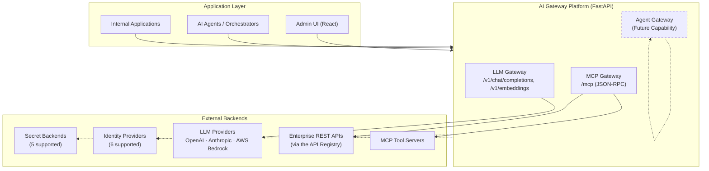
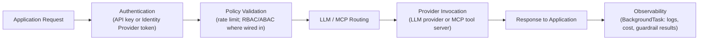
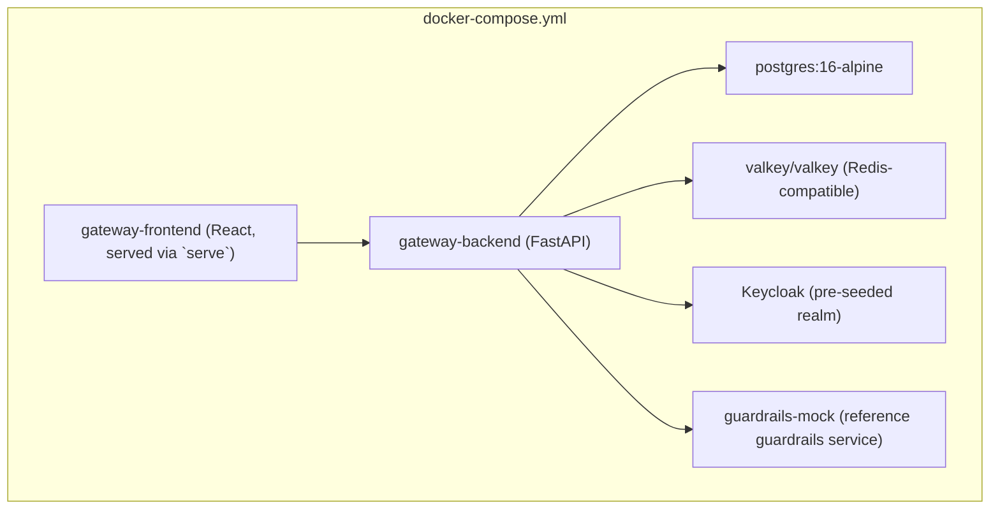

# High Level Design (HLD)

**Document type:** Architecture review reference
**Audience:** Enterprise Architects, Solution Architects, CTO/CIO stakeholders, Security Architects
**Scope:** Reflects the implemented codebase as of this review. Every capability described is either **Implemented**, or explicitly marked **Future Capability**, **Roadmap Item**, or **Planned Enhancement**. For the API Registry (REST APIs exposed as MCP tools) in full depth, see [../docs/api-registry.md](../docs/api-registry.md).

---

## 1. Executive Summary

### Business problem

Enterprises adopting Generative AI hit a structural gap: LLM providers, identity systems, and internal tools all expose different APIs, auth models, and cost surfaces, and no single layer in a typical stack is responsible for governing how AI capabilities are consumed across the organization. Each application team ends up re-solving authentication, provider integration, rate limiting, and cost tracking independently — inconsistently, and usually without central visibility.

### Enterprise AI adoption challenges

- **Provider fragmentation** — OpenAI, Anthropic, and AWS Bedrock each require their own SDK, credentials, and failure handling.
- **Data security exposure** — prompts and completions carry sensitive business data with no mandatory inspection point.
- **Uncontrolled cost growth** — usage-based LLM spend accumulates across many applications with no shared ledger.
- **Inconsistent governance** — access control, rate limits, and audit trails are implemented per application, if at all.
- **Shadow AI** — without an easy, sanctioned integration path, teams route around IT visibility entirely.
- **Emerging tool/agent security surface** — as applications move from asking a model questions to letting it invoke internal systems, a second governance boundary opens that most organizations have no answer for yet.

### Purpose of the AI Gateway Platform

The AI Gateway Platform is a self-hosted, centralized control plane that mediates every call between internal applications and the AI capabilities they use: language models today, MCP-based tools today, and (as a **Future Capability**) autonomous agents. It gives the enterprise one place to enforce authentication, authorization, cost accounting, and governance — regardless of which provider, identity system, or tool server sits behind it.

---

## 2. System Overview

The **Enterprise AI Gateway Platform** is implemented as a single FastAPI backend service plus a companion React administration UI. It provides:

- **Model governance** — centralized routing rules decide which provider serves a given model alias; nothing calls a provider directly except through the gateway.
- **AI security** — every request passes through authentication, RBAC/ABAC policy checks (where wired in), and pluggable guardrail checks.
- **Cost management** — every priced request is recorded to a cost ledger, attributable to organization, project, and user, with configurable budgets.
- **Observability** — structured request logging and database-backed usage/cost/guardrail analytics, surfaced through admin dashboards and query APIs.
- **Enterprise integration** — pluggable abstractions for identity providers (six implemented) and secret backends (five implemented), so the platform integrates with an organization's existing identity and secrets infrastructure rather than requiring a new one.

Today this control plane governs two subsystems — the **LLM Gateway** and the **MCP Gateway**, the latter of which spans two execution paths: native MCP servers, and the **API Registry**, which exposes ordinary enterprise REST APIs as MCP tools without requiring an MCP server to be built for them. A third top-level subsystem, the **Agent Gateway**, is a documented **Future Capability** with no implementation in the current codebase (see Section 9).

---

## 3. Architecture Overview

### 3.1 Layered view



### 3.2 Governed subsystems

```
Application Layer
      |
AI Gateway Platform
      |
+----------------+
| LLM Gateway    |   <- implemented
+----------------+
      |
+----------------+
| MCP Gateway    |   <- implemented
+----------------+
      |
      |  (Future)
+----------------+
| Agent Gateway  |   <- Future Capability / Roadmap Item
+----------------+
```

Both implemented gateways run inside one FastAPI process and are architecturally independent of each other: neither is aware the other exists. An external agent framework that needs multi-step tool use alternates between them over plain HTTP calls — this is a deliberate boundary, not a gap, and is precisely the seam the future Agent Gateway is intended to fill.

---

## 4. Major Components

### 4.1 LLM Gateway

**Responsibilities (implemented):**
- **Unified LLM API** — a single OpenAI-compatible interface (`/v1/chat/completions`, `/v1/embeddings`) for every application, regardless of upstream provider.
- **Provider abstraction** — requests are routed through an embedded LiteLLM router; OpenAI, Anthropic, and AWS Bedrock are wired in today.
- **Routing** — administrator-defined `model_alias → provider/model targets` rules, selectable by priority, cost, or latency strategy, scoped optionally to a project and to a `chat` or `embedding` capability.
- **Failover** — when a routing rule lists multiple targets, the router retries against the next target on failure.
- **Cost tracking** — every request is priced from an admin-maintained pricing table and written to a cost ledger attributed to organization/project/user; response caching avoids repeat provider spend on identical prompts.
- **Observability** — structured request logs plus a queryable usage-summary and request-log API back the admin dashboards.

### 4.2 MCP Gateway

**Responsibilities (implemented):**
- **MCP server management** — tool-providing servers are registered, health-checked, and administratively enabled/disabled through a dedicated registry.
- **Tool governance** — a background discovery process keeps a gateway-wide tool catalog in sync with each registered server; a tool is only routable when its server is both administratively active and currently healthy.
- **Secure tool invocation** — every `tools/call` is authenticated, scope-checked (`tool:read` vs `tool:execute`), per-tool rate-limited, and — for identity-provider-authenticated human callers — evaluated against RBAC/ABAC access policies (scoped to specific tool names, MCP- or REST-backed) before being forwarded.
- **API Registry — REST APIs as MCP tools** — an enterprise REST API and its endpoints are registered directly (no MCP server, no discovery step); each registered endpoint immediately becomes a callable MCP tool with an auto-generated schema. Credentials are resolved through the Secret Provider layer; a non-2xx response from the target API comes back as an ordinary tool result (`isError: true`), not a gateway failure. An agent calling `tools/call` cannot tell — and does not need to tell — whether a given tool is MCP-backed or REST-backed.

### 4.3 Identity Layer

A pluggable `IdentityProvider` abstraction decouples the gateway from any single identity system. **Six providers are implemented**:

| Provider | Status |
|---|---|
| Keycloak | Implemented (default) |
| Microsoft Entra ID | Implemented |
| Auth0 | Implemented |
| Okta Workforce Identity Cloud | Implemented |
| AWS IAM Identity Center | Implemented |
| Google Identity Platform / Workspace | Implemented |

Every provider validates a bearer token (RS256, JWKS-based) and resolves it into a common `UserIdentity` shape (user, email, tenant, provider, roles, groups, attributes). Multi-tenant deployments can run **different providers for different tenants** against the same running gateway, resolved automatically from the token's issuer.

### 4.4 Secret Management Layer

A parallel `SecretProvider` abstraction resolves every credential the gateway needs — LLM provider keys, MCP server outbound auth, identity-provider client secrets — from exactly one configured backend, never from scattered plain environment variables. **Five backends are implemented**: this app's own Postgres database (default, values Fernet-encrypted at rest), AWS Secrets Manager, Azure Key Vault, Google Secret Manager, and HashiCorp Vault. Resolved values are cached briefly and never persisted to the application database in plaintext or logged.

### 4.5 Policy and Governance Layer

- **Authentication policies** — enforced uniformly for every request via the auth middleware, whether the caller presents an API key or an identity-provider token.
- **Authorization** — API keys carry explicit capability scopes; identity-provider-authenticated users carry roles and (optionally) an RBAC/ABAC `AccessPolicy` evaluation.
- **Rate limits** — a shared-cache-backed sliding-window limiter applies per API key on the LLM Gateway and MCP Gateway endpoints, plus a finer per-tool limit inside MCP, and (for REST-backed tools specifically) a per-API-service limit on top of that.
- **Security controls** — hashed API keys, RS256/JWKS token validation, and pluggable prompt/response guardrail checks on every LLM Gateway call.

---

## 5. End-to-End Request Flow



This flow is common to both gateways at the architecture level; Section 4 of the companion LLD document details the differences (guardrail checks are LLM-Gateway-only; policy evaluation today is wired only into MCP's `tools/call`, applying identically whether the resolved tool is MCP- or REST-backed).

---

## 6. Deployment Architecture

**Implemented — Docker Compose (local / single-node):**



Every component ships its own Dockerfile; `gateway-backend` runs database migrations (`alembic upgrade head`) automatically on startup before serving traffic.

**Implemented — cloud deployment model:** because every external dependency (identity provider, secret backend, LLM provider) is selected through configuration rather than hard-coded, the same container images run unmodified on a VM, an existing container platform, or a managed Kubernetes cluster with an externally-provisioned Postgres/Redis-compatible pair.

**Not yet implemented — Roadmap Item:** Kubernetes manifests, Helm charts, and a CI/CD pipeline do not exist in the repository today. The container images are Kubernetes-compatible, but no cluster deployment artifacts have been authored.

---

## 7. Security Architecture

- **Authentication** — every request (except `/health`, `/ready`, and API docs routes) requires a bearer credential: either a hashed, revocable API key scoped to a project, or an identity-provider token validated via RS256/JWKS with expiration, issuer, and audience checks enforced.
- **Authorization** — API keys carry explicit scopes; identity-provider users carry role and (for MCP tool calls specifically) RBAC/ABAC policy evaluation against their roles and identity provider.
- **Secrets protection** — provider credentials, identity-provider client secrets, and API Registry (REST tool) credentials are resolved through the Secret Provider abstraction and never written to a log line in plaintext. The default backend (Postgres) stores values Fernet-encrypted at rest under a key held only in app config, never in the database itself; the AWS/GCP/Azure/Vault backends keep values out of the application database entirely. Every backend's resolved value is still cached briefly in Valkey. (MCP server outbound auth is the one exception, still resolved from a named environment variable rather than this abstraction — a documented asymmetry, not an oversight.)
- **Audit logging** — secret access operations (read/rotate) are recorded to a dedicated audit table with actor, operation, and outcome. **A general-purpose administrative audit trail beyond secrets is not yet implemented — Planned Enhancement.**
- **Tenant isolation** — an Organization → Project → Users/API Keys hierarchy scopes every request log, cost ledger entry, and API key to a specific tenant boundary; multi-tenant identity resolution (different IdP per tenant) is implemented, while per-tenant "bring your own LLM provider key" routing exists at the secret-layer level but is **not yet wired into live chat/embeddings routing — Planned Enhancement.**

**Explicitly out of scope today** (documented, not silently missing): enforcement of budget and access-policy token ceilings at request time (currently visible/advisory only).

---

## 8. Scalability and Availability

- **Stateless services** — the FastAPI backend holds no in-process session state; every request independently authenticates and every per-request `Principal` lives only for that request's lifetime. This allows multiple backend instances to run behind a load balancer without session affinity.
- **Horizontal scaling** — because state (relational data, cache, rate-limit counters) lives in Postgres and the shared Valkey cache rather than in-process memory, additional backend instances can be added without code changes.
- **Load balancing** — standard HTTP load balancing in front of multiple backend instances is supported by the stateless design; the repository does not itself ship a load balancer configuration (this is an infrastructure-layer concern, left to the deployment environment).
- **Failure handling** — LLM provider failures trigger the router's configured retry against the next available target in a routing rule; MCP tool servers are continuously health-checked, and traffic is only routed to servers that are both administratively active and currently healthy, so a down tool server is automatically excluded from routing until it recovers.

---

## 9. Future Architecture Roadmap

### Agent Gateway — Future Capability

**No implementation exists in the current codebase.** The word "agent" appears today only in documentation describing how an *external* agent framework consumes the two existing gateways — it alternates between `POST /mcp` (tool discovery/invocation) and `POST /v1/chat/completions` (reasoning) entirely outside this platform. The Agent Gateway is the planned extension that brings that consumption pattern under the platform's own governance, reusing the same abstraction pattern already proven by the Identity and Secret layers:

- **Agent registry** — a formal catalog of agents, analogous to today's MCP server registry.
- **Agent identity** — extending the existing `IdentityProvider`/`UserIdentity` model so an agent, not only a human or an API key, can be a first-class authenticated principal.
- **Agent authorization** — extending the existing `PolicyEngine`/`AccessPolicy` model to gate which agents a caller may invoke.
- **Agent lifecycle management** — provisioning, versioning, and retiring agents under the same administrative control already applied to identity providers, secret backends, and MCP servers.

### Other roadmap items

- **Advanced policy engine** — enforcement (not just visibility) of budget ceilings and access-policy token limits at request time.
- **AI FinOps** — deeper cost allocation, forecasting, and chargeback built on the existing cost ledger.
- **AI evaluation framework** — systematic quality/safety evaluation of model outputs over time.
- **Kubernetes-native deployment** — manifests/Helm charts and a CI/CD pipeline.
