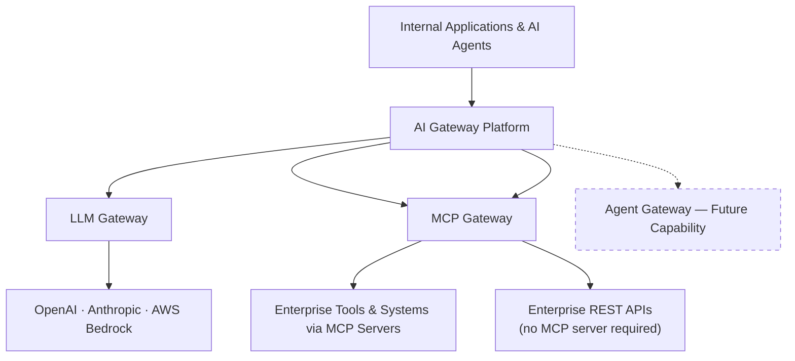

# Enterprise AI Gateway Platform

*One secure control plane for enterprise AI applications, models, tools, and agents.*

---

## Executive Overview

Every enterprise adopting Generative AI runs into the same wall within months of its first pilot: what started as one team calling one LLM provider becomes dozens of applications, several providers, uncontrolled spend, and no consistent story for security or compliance. The platforms and tools involved were never designed with a central governance layer in mind — so organizations either bolt on point solutions per team, or leave the gap open.

The specific pressures we hear from CIOs, CTOs, and Enterprise Architects:

- **Multiple LLM providers, no common front door.** OpenAI, Anthropic, AWS Bedrock — each with its own SDK, auth model, and outage profile. Every application team re-solves the same integration problem.
- **Data security concerns.** Prompts and completions carry sensitive business data. Without a mandatory inspection point, there is no consistent way to catch what shouldn't leave the building.
- **AI cost management.** LLM spend is usage-based and can grow silently across dozens of applications with no shared visibility into who is spending what, on which model.
- **Lack of governance.** Model access, tool access, and roles are usually enforced ad hoc — inconsistently, per application — rather than as a single, auditable policy layer.
- **Shadow AI adoption.** When there's no sanctioned, easy path to call an LLM safely, teams find their own path outside IT's visibility.
- **Tool and agent security challenges.** As applications move from "ask a model a question" to "let a model call internal tools and systems," a second, distinct security surface opens up — one most organizations have no plan for yet.

## Our Solution

The Enterprise AI Gateway Platform is a self-hosted control plane that sits between internal applications and every AI capability they consume — models today, tools today, and autonomous agents on the roadmap. It gives the organization one place to enforce authentication, authorization, cost control, and governance, regardless of which provider or backend system sits behind it.

Applications integrate once, against a single, familiar, OpenAI-compatible API and a single tool-access API. The platform decides — centrally, consistently, and auditably — which provider handles the request, who is allowed to make it, what it costs, and what happened.

## Platform Capabilities

### LLM Gateway

A single, OpenAI-compatible endpoint for chat and embeddings that stands between every application and the LLM providers behind it.

- **Multi-model access** — one API contract for chat completions and embeddings, regardless of which provider ultimately serves the request.
- **Provider abstraction** — OpenAI, Anthropic, and AWS Bedrock are wired in today behind the same interface, so switching or adding a provider is a configuration change, not an application rewrite.
- **Intelligent routing** — administrators define model aliases and routing rules (by priority, cost, or latency) once; every application simply asks for an alias.
- **Cost optimization** — every request is priced against an admin-maintained pricing table and recorded to a cost ledger, with response caching to avoid paying twice for the same answer.
- **Security controls** — every call is authenticated, scope-checked, rate-limited, and passed through a pluggable guardrails check before it reaches a provider and after it returns.
- **Observability** — every request, its routing decision, its cost, and its guardrail outcome are logged and queryable through admin dashboards and a usage-summary API.

### MCP Gateway

A governed on-ramp for connecting applications and AI agents to internal tools and systems via the Model Context Protocol (MCP) — without every application team having to individually secure and manage each tool integration.

- **Secure access to enterprise tools** — a single JSON-RPC entry point brokers every tool call, rather than applications reaching out to tool servers directly.
- **REST APIs become AI tools instantly** — register any existing enterprise REST API and its endpoints, and they're immediately callable by an agent as governed tools — no MCP server has to be built. This means the vast majority of an enterprise's existing systems (ticketing, CRM, order lookup, internal line-of-business APIs) can be exposed to AI safely without a new integration project per system.
- **MCP server governance** — tool servers are registered, health-checked, and centrally managed, with visibility into which are currently reachable.
- **Authentication** — every caller, human or application, is authenticated before a tool call is even considered.
- **Authorization** — access to read tool metadata versus actually invoking a tool are distinct, separately grantable permissions.
- **Tool discovery** — the platform automatically discovers what tools each registered MCP server offers (and instantly catalogs each REST endpoint the moment it's registered), keeping one unified catalog current.
- **Policy enforcement** — role-, identity-provider-, and tool-specific access policies gate which tools a given user is permitted to call — the same policy whether that tool happens to be MCP- or REST-backed — evaluated centrally rather than left to each tool server.

### Agent Gateway (Future Capability)

**Status: Coming Soon — not yet available.**

As organizations move from single-turn model calls toward autonomous, multi-step AI agents, a third governance surface becomes necessary: the agents themselves. The planned Agent Gateway extends the same control-plane philosophy to that layer:

- **Agent registration** — a formal registry of which agents exist, analogous to today's tool-server registry.
- **Agent discovery** — a catalog applications can query to find available agents and their capabilities.
- **Agent lifecycle management** — provisioning, versioning, and retiring agents under central control.
- **Agent-to-agent communication governance** — visibility and policy enforcement over agents that call other agents, not just tools.
- **Agent security policies** — extending the platform's existing identity- and role-based policy model to agent identities specifically.

## Business Benefits

- **Faster AI adoption** — application teams integrate once against a stable, provider-agnostic API instead of re-solving auth, routing, and governance per project.
- **Reduced AI operational cost** — centralized cost tracking, budgets, and response caching turn invisible, distributed spend into a single, visible ledger.
- **Enterprise governance** — one policy layer for who can use which models and tools, instead of governance re-implemented (or skipped) per application.
- **Vendor independence** — provider switches and additions happen behind the gateway; applications never hard-code a single vendor's SDK.
- **Improved security** — every prompt, response, and tool call passes through the same authentication, authorization, and guardrail checkpoints, closing the door on shadow AI.
- **Compliance readiness** — centralized request logging, cost attribution, and access policy records give security and compliance teams a single source of truth to audit against.

## Enterprise Use Cases

- **Enterprise knowledge assistant** — a chat application serving employees, routed through the LLM Gateway for consistent cost tracking and guardrail enforcement across the whole company.
- **Customer service AI agents** — support tooling that calls both the LLM Gateway (for responses) and the MCP Gateway (for looking up order or account data via governed tools).
- **Software engineering agents** — developer-facing AI assistants that call internal tools (repositories, ticketing, CI systems) exclusively through the MCP Gateway's authenticated, policy-checked path.
- **Document intelligence** — embedding-based search and retrieval workloads running through the same governed embeddings endpoint used by every other application.
- **Business process automation** — workflows that combine model calls and internal tool invocations, each independently authenticated, rate-limited, and logged.
- **Legacy and line-of-business system integration** — an agent needs to look up a customer record, create a ticket, or check an order status against systems that were never built with AI (or MCP) in mind. Registering those existing REST APIs takes minutes, not a new integration project, and every call is governed exactly like a native tool.

## Why Our Platform

- **Enterprise-first architecture** — organizations, projects, users, and role-based access are first-class concepts, not an afterthought bolted onto a developer tool.
- **Open architecture** — every backend dependency (identity provider, secret store, LLM provider, tool server) sits behind a pluggable abstraction, not a hard-coded integration.
- **Cloud and model vendor neutral** — self-hosted, deployable in any environment, with no single provider lock-in for identity, secrets, or models.
- **Security by design** — authentication, authorization, and policy checks are structural parts of every request path, not optional middleware a team can forget to add.
- **Extensible AI control plane** — the same abstraction pattern that supports six identity providers, five secret-management backends, and now both MCP servers and arbitrary REST APIs as governed tools today is the foundation the Agent Gateway will extend tomorrow.

## Future Roadmap

- **Agent Gateway** — agent registration, discovery, lifecycle management, and agent-to-agent governance (see above).
- **Advanced policy engine** — enforcement of token/spend ceilings at request time, not just visibility after the fact.
- **AI FinOps** — deeper cost allocation, forecasting, and chargeback capabilities built on the existing cost ledger.
- **AI evaluation framework** — systematic quality and safety evaluation of model and agent outputs over time.
