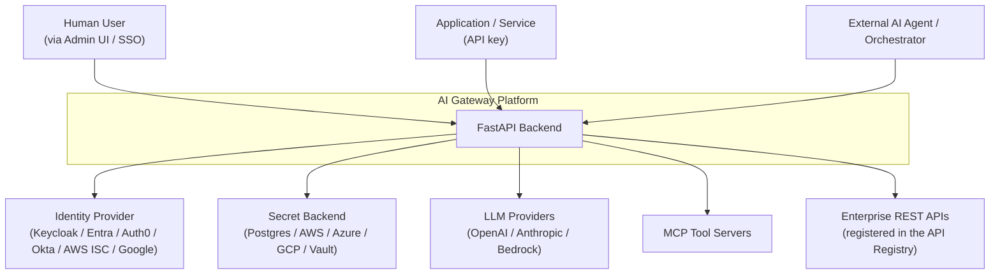
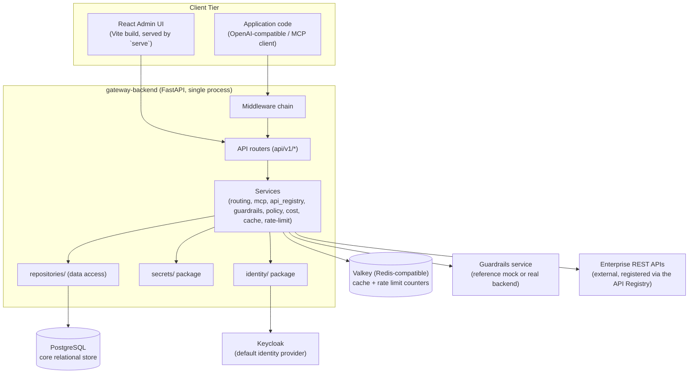
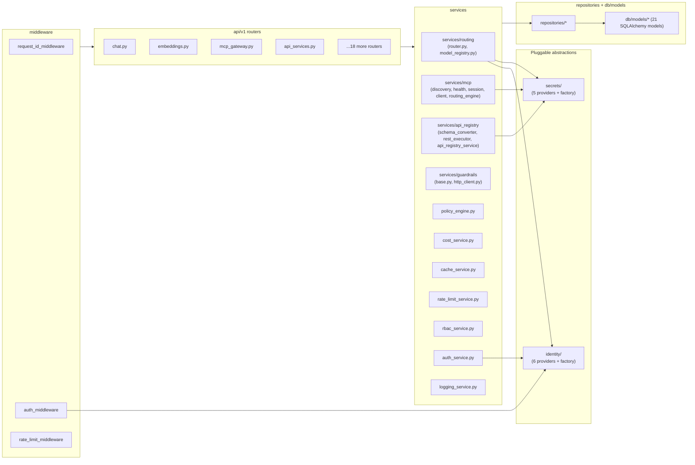
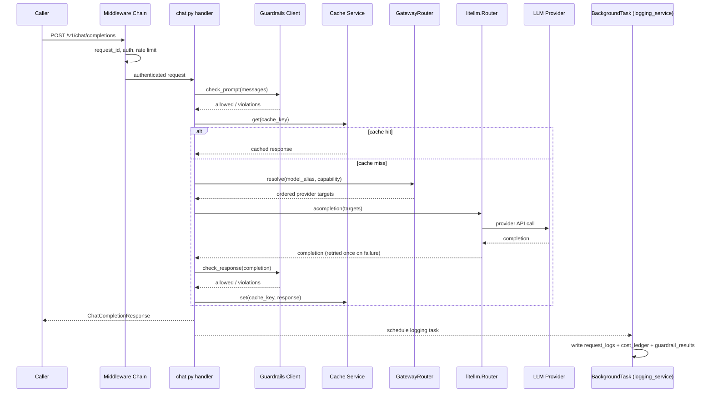
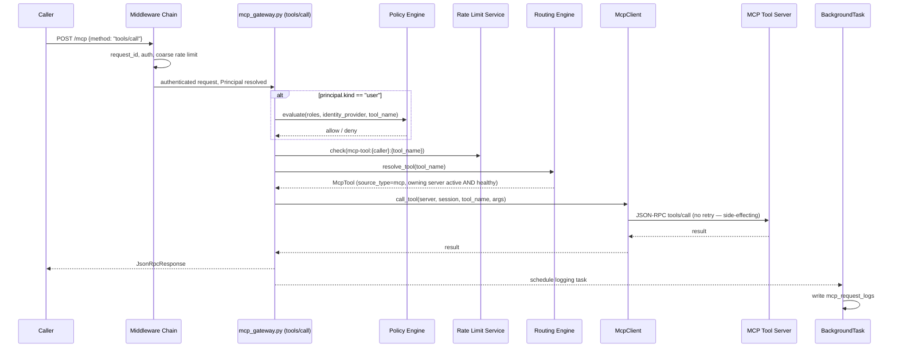
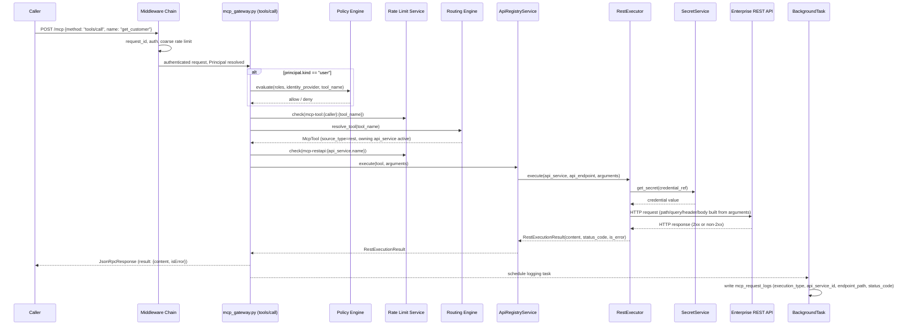
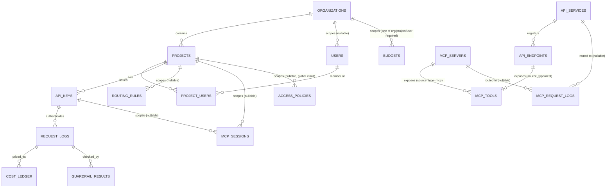

# Low Level Design (LLD)

**Document type:** Engineering design reference
**Audience:** Developers, Engineering Teams, Platform Engineers
**Companion document:** [HLD.md](HLD.md) explains WHAT and WHY; this document explains HOW. Every statement below is verified against the actual source tree — nothing here is invented. Items not yet implemented are explicitly marked **Future Capability**, **Roadmap Item**, or **Planned Enhancement**.

---

## 0. Architecture Diagrams

### 0.1 Context Diagram



### 0.2 Container Diagram



### 0.3 Component Diagram (backend/app internal)



### 0.4 Deployment Diagram

See Section 14 (Configuration Management) for the full docker-compose service table; the diagram is reproduced in HLD.md §6.

---

## 1. Component Detailed Design

| Component | Purpose | Internal modules | Key dependencies |
|---|---|---|---|
| **LLM Gateway** | OpenAI-compatible chat/embeddings with governed routing | `api/v1/chat.py`, `api/v1/embeddings.py`, `services/routing/{router.py, model_registry.py}`, `services/cache_service.py`, `services/cost_service.py`, `services/guardrails/*` | LiteLLM, Valkey, Postgres, Secret Provider layer |
| **MCP Gateway** | Governed access to MCP tool servers | `api/v1/mcp_gateway.py`, `api/v1/mcp_servers.py`, `api/v1/mcp_tools.py`, `api/v1/mcp_sessions.py`, `services/mcp/{discovery_service, health_checker, mcp_client, routing_engine, session_manager}` | httpx, Postgres, Secret Provider layer (server outbound auth reads a named env var, not the Secret Provider abstraction — see §6) |
| **API Registry** | Exposes enterprise REST APIs as MCP tools, dispatched through the same `POST /mcp` `tools/call` as MCP-server tools | `api/v1/api_services.py`, `services/api_registry/{schema_converter, rest_executor, api_registry_service}` | httpx, tenacity, Postgres, Secret Provider layer, Valkey (OAuth2 token cache) — see §6 |
| **Identity Layer** | Provider-agnostic authentication | `identity/{base, models, factory, keycloak_provider, entra_provider, auth0_provider, okta_provider, aws_identity_provider, google_identity_provider}` | PyJWT (`jwt.PyJWKClient`), each provider's JWKS endpoint |
| **Secret Management Layer** | Provider-agnostic credential resolution | `secrets/{base, factory, service, postgres_provider, aws_provider, azure_provider, gcp_provider, vault_provider}` | cryptography (Fernet) / boto3 / azure-keyvault / google-cloud-secret-manager / hvac (per backend), Postgres, Valkey (cache) |
| **Policy & Governance Layer** | RBAC/ABAC evaluation, rate limiting, RBAC role checks | `services/policy_engine.py`, `services/rbac_service.py`, `services/rate_limit_service.py`, `middleware/rate_limit_middleware.py` | Postgres (`access_policies`), Valkey (rate counters) |
| **Admin UI** | Human-facing control surface | `frontend/src/pages/*`, `frontend/src/services/{api.js, authService.js}` | keycloak-js, axios, recharts |

---

## 2. Backend Architecture

Actual `backend/app/` structure:

```
backend/app/
├── main.py                     # app assembly: middleware, routers, exception handler, startup/shutdown tasks
├── api/
│   ├── deps.py                 # FastAPI Depends() providers: sessions, repos, current principal/user/identity, policy engine
│   └── v1/                     # 22 routers, one per domain, each with its own OpenAPI tag
├── core/
│   ├── config.py                # Settings (Pydantic Settings) — single source of all env-driven config
│   ├── exceptions.py             # GatewayException + typed subclasses
│   ├── logging.py                 # structlog configuration
│   └── security.py                # API-key hashing/verification only (JWT/OIDC lives in identity/)
├── db/
│   ├── base.py / session.py / valkey.py   # SQLAlchemy Base, async engine/session factory, Valkey client
│   └── models/                     # 21 SQLAlchemy ORM models + enums.py
├── identity/                    # IdentityProvider abstraction — see §7
├── middleware/                  # request_id, auth, rate_limit
├── repositories/                # one thin data-access class per model, used only by services
├── schemas/                     # Pydantic request/response models — see §3
├── secrets/                     # SecretProvider abstraction — see §8
└── services/
    ├── auth_service.py, cache_service.py, cost_service.py, logging_service.py,
    │   policy_engine.py, rate_limit_service.py, rbac_service.py
    ├── guardrails/               # GuardrailsClient ABC + HTTP implementation
    ├── mcp/                      # discovery, health, session, client, routing_engine
    ├── api_registry/             # schema_converter, rest_executor, api_registry_service -- see §6, docs/api-registry.md
    └── routing/                  # LiteLLM router wrapper + model registry
```

Module responsibilities:
- **`api/`** — HTTP-layer concerns only (request parsing, response shaping, dependency wiring); no business logic.
- **`services/`** — business logic, one facade class per domain, exposed via each package's `__init__.py`; routers call the facade only, never internals.
- **`repositories/`** — thin, model-scoped DB access; used only by services, never directly by routers.
- **`schemas/`** — API contracts (Pydantic), independent of SQLAlchemy models.
- **`identity/` and `secrets/`** — the platform's two pluggable-backend abstractions, structurally identical (ABC + factory + per-implementation module).
- **`middleware/`** — cross-cutting request pipeline concerns applied to every route.
- **`db/models/`** — persistence schema, one file per table plus `enums.py` for shared Postgres enum types.

There is no dedicated `observability/` package — logging is configured once in `core/logging.py` and applied via `structlog`; DB-backed analytics live in `services/logging_service.py` writing to the `request_logs`/`mcp_request_logs`/`cost_ledger`/`guardrail_results` tables (see §11).

---

## 3. API Design

All endpoints require a bearer credential except `/health`, `/ready`, `/docs`, `/openapi.json`, `/redoc` (`AuthMiddleware.UNAUTHENTICATED_PATHS`). Every error response uses the same envelope (`ErrorResponse` in `schemas/common.py`):

```json
{ "error": { "code": "provider_error", "message": "...", "request_id": "..." } }
```

### `POST /v1/chat/completions`

- **Purpose**: send a chat completion request through the gateway.
- **Auth**: API key (any scope check is at the routing/policy layer, not endpoint-specific scopes) or identity-provider token.
- **Request** (`ChatCompletionRequest`): `model: str`, `messages: list[{role, content}]`, `temperature: float=1.0`, `max_tokens: int|None`, `top_p: float|None`, `stream: bool=False` (accepted but not honored — see §4), `user: str|None`.
- **Response** (`ChatCompletionResponse`): `id`, `object="chat.completion"`, `created`, `model`, `choices: [{index, message, finish_reason}]`, `usage: {prompt_tokens, completion_tokens, total_tokens}`, `gateway_metadata: {request_id, resolved_provider, resolved_model, cache_hit, cost_usd}`.
- **Errors**: `401 unauthorized`, `422 guardrail_blocked`, `429 rate_limited`, `502 provider_error`, `404 not_found` (unknown model alias).

### `POST /v1/embeddings`

- **Purpose**: send an embedding request through the gateway.
- **Auth**: same as chat.
- **Request** (`EmbeddingRequest`): `model: str`, `input: str | list[str]`, `encoding_format: "float"|"base64"="float"`, `user: str|None`.
- **Response** (`EmbeddingResponse`): `object="list"`, `model`, `data: [{index, embedding}]`, `usage: {prompt_tokens, total_tokens}`, `gateway_metadata` (same shape as chat).
- **Errors**: same set as chat, minus `guardrail_blocked` (no response-side guardrail check on embeddings).

### `POST /mcp`

- **Purpose**: single JSON-RPC 2.0 entry point for MCP `initialize`, `tools/list`, `tools/call`.
- **Auth**: API key with `tool:read`/`tool:execute` scope, or identity-provider token (scopes derived from role).
- **Request** (`JsonRpcRequest`): `jsonrpc="2.0"`, `id: str|int|None`, `method: str`, `params: dict|None`.
- **Response** (`JsonRpcResponse`): `jsonrpc="2.0"`, `id`, and either `result` or `error: {code, message, data}` — never both.
- **Errors**: JSON-RPC errors are carried inside the 200-status envelope's `error` field for protocol-level failures (per JSON-RPC 2.0 convention); transport/auth/rate-limit failures still use the standard `ErrorResponse` envelope at the HTTP layer (401/403/429/502). For a REST-backed tool specifically, a non-2xx response from the target API is **not** a JSON-RPC or HTTP error at all — it comes back as an ordinary `result` with `isError: true` (see §6).

### `POST /mcp/api-services`, `PUT`/`DELETE /mcp/api-services/{id}`

- **Purpose**: register/update/remove a REST API backend (the API Registry — see §6).
- **Auth**: identity-provider token, admin only.
- **Request** (`ApiServiceCreate`/`ApiServiceUpdate`): `name`, `base_url`, `authentication_type` (`none`/`api_key`/`bearer`/`basic`/`oauth2_client_credentials`), `auth_config`, `headers`, `timeout_seconds=10.0`, `retry_policy`, `rate_limit_per_window`, `status`, `metadata`.
- **Response** (`ApiServiceOut`): all of the above plus `id`, `created_at`, `endpoint_count`.
- **Errors**: `403 forbidden`, `404 not_found`.

### `GET/POST /mcp/api-services/{id}/endpoints`, `PUT`/`DELETE .../endpoints/{endpoint_id}`

- **Purpose**: register/update/remove a REST endpoint under a service — **registering one immediately creates its paired MCP tool**, no separate sync step.
- **Auth**: identity-provider token, admin only.
- **Request** (`ApiEndpointCreate`/`Update`): `tool_name` (unique gateway-wide, immutable after creation), `description`, `method` (`GET`/`POST`/`PUT`/`DELETE`), `path`, `parameters: {name: {type, required, location, description}}`.
- **Response** (`ApiEndpointOut`): all of the above plus `id`, `api_service_id`, `api_service_name`, `updated_at`.
- **Errors**: `400 bad_request` (duplicate `tool_name`, including a collision with an existing MCP-server-sourced tool name), `403 forbidden`, `404 not_found`.

### `POST /v1/auth/token/exchange`

- **Purpose**: exchange an already-validated identity-provider session for the gateway's own `SessionInfo` view (role, tenant, roles/groups/attributes).
- **Auth**: identity-provider token only.
- **Response** (`SessionInfo`): `user_id`, `email`, `role`, `organization_id`, `identity_provider`, `tenant_id`, `roles: []`, `groups: []`, `attributes: {}`.

### `GET/POST /v1/keys`, `DELETE /v1/keys/{id}`

- **Purpose**: issue, list, and revoke API keys.
- **Auth**: identity-provider token (human, admin/team_lead).
- **Request** (`ApiKeyCreate`): `name`, `project_id`, `scopes: []`.
- **Response** (`ApiKeyOut`): `id`, `project_id`, `prefix`, `name`, `scopes`, `is_active`, `raw_key` (populated only on the creation response — never retrievable again), `created_at`, `last_used_at`.
- **Errors**: `403 forbidden` (insufficient role), `404 not_found`.

### Remaining routers (CRUD pattern, admin/team_lead-gated)

`organizations.py`, `projects.py`, `users.py`, `project_users.py`, `provider_configs.py`, `routing_rules.py`, `budgets.py`, `model_pricing.py` all follow the same `GET (list) / POST (create) / PATCH (update) / DELETE (where applicable)` pattern against their respective model, each returning its schema's `*Out` shape and `404 not_found` / `400 bad_request` on invalid input. `usage.py` (`GET /v1/usage/summary`) and `logs.py` (`GET /v1/logs`) are read-only aggregation/query endpoints over `cost_ledger`/`request_logs`. `mcp_servers.py`, `mcp_tools.py`, `mcp_sessions.py` are the MCP-side equivalents (registry CRUD, tool catalog + manual sync, session viewer). `api_services.py` is the API Registry's admin surface (service + nested endpoint CRUD — see §3, §6). `secrets.py` and `identity.py` are the admin surfaces for their respective abstraction layers (provider status, tenant configs, access policies, secret rotation — never a secret value). `health.py` exposes `GET /health` (liveness) and `GET /ready` (dependency check against Postgres, Valkey, Keycloak, guardrails, each via a 2-second hardcoded HTTP/connection check).

---

## 4. LLM Gateway Internal Flow

```
Request
 |
RequestIDMiddleware   -> generates/propagates request_id, binds to structlog context
 |
AuthMiddleware         -> resolves Principal (api_key or identity-provider user)
 |
RateLimitMiddleware    -> Valkey sliding-window check, keyed on api_key.id (skipped for user-token principals)
 |
chat.py / embeddings.py handler
 |
Guardrails.check_prompt()   -> HttpGuardrailsClient, tenacity retry (2 attempts) on transport errors
 |
CacheService.get()          -> Valkey lookup keyed on sha256(normalized payload); hit -> return, $0, skip routing
 |
GatewayRouter.resolve()     -> best-match routing_rules row by alias+project+capability, targets ordered by strategy
 |
litellm.Router.acompletion()/.aembedding()  -> num_retries=1 across resolved targets
 |
Guardrails.check_response() -> chat only, not embeddings
 |
CostService.calculate()     -> model_pricing lookup, $0 if no pricing row
 |
CacheService.set()
 |
Response returned to caller
 |
BackgroundTask: logging_service writes request_logs + cost_ledger + guardrail_results (after response is sent — adds no client-facing latency)
```

**Sequence diagram — LLM request flow:**



**Note on streaming:** `ChatCompletionRequest.stream` is accepted as a field but the gateway always returns a fully-buffered response — true token streaming is a documented deferred item, not a current capability.

---

## 5. Model Provider Integration Design

- **LiteLLM integration**: `services/routing/model_registry.py::build_router()` constructs a `litellm.Router(model_list=[...], routing_strategy="simple-shuffle", num_retries=1)` per resolved rule, rather than running LiteLLM as a separate proxy process — it is embedded directly in the FastAPI process.
- **Provider abstraction mechanism**: `_SECRET_NAMES_FOR_PROVIDER` maps a provider enum value to the Secret Provider name(s) it needs (e.g. `OPENAI_API_KEY`, `ANTHROPIC_API_KEY`, AWS credential triple); `model_registry.py` resolves those via `SecretService.get_secret()` before constructing the LiteLLM model list, so no provider credential is ever read from a bare `os.environ` call in this path.
- **Supported providers today**: **OpenAI**, **Anthropic**, **AWS Bedrock** — these three appear in `ProviderNameEnum` (the Postgres enum) and have working `_SECRET_NAMES_FOR_PROVIDER` entries.
- **Google, Azure OpenAI, self-hosted/local models — Planned Enhancement.** Secret-name conventions for Google/Azure exist in the Secret Provider layer's documentation but are explicitly reserved for a future routing target; there is no `ProviderNameEnum` value and no routing logic for them today. Local/self-hosted model serving (e.g. an OpenAI-compatible local endpoint) is not implemented.
- **Model pricing** is a separate concern from provider routing: `model_pricing` rows (provider, model, prompt/completion per-1k USD) are seeded via migration `0002_model_pricing.py` for 8 models across the 3 supported providers and are independently admin-editable.

---

## 6. MCP Gateway Design

```
MCP Server Registration (admin API, mcp_servers.py)
        |
Authentication (AuthMiddleware — API key or IdP token)
        |
Policy Validation (per-tool scope check; PolicyEngine for IdP-user callers on tools/call only)
        |
Tool Discovery (DiscoveryService: initialize + tools/list, reconciled into mcp_tools)
        |
Tool Execution (McpClient.call_tool via routing_engine's owning-server resolution)
```

- **MCP server lifecycle**: a server is created via `POST /mcp/servers` with `name` (unique), `base_url`, `transport_type` (only `http` exists — `McpTransportType` enum has a single member), and `auth_config`. Its `status` (active/inactive, admin-controlled) and `health_status` (unknown/healthy/unhealthy, system-controlled) are independent axes; `routing_engine.is_routable()` requires both `status == active` and `health_status == healthy` before a tool call is forwarded to it.
- **Tool metadata**: `DiscoveryService.sync_server()` calls the server's `initialize` (liveness probe) then `tools/list`, and reconciles the results into the gateway-wide `mcp_tools` table — new tools are inserted, disappeared tools are removed, and a tool-name collision across servers is resolved last-write-wins (the most recently synced owner wins). Discovery runs on a background loop (`mcp_discovery_refresh_seconds`, default 300s; `0` disables it) and can be triggered on demand via `POST /mcp/tools/sync`.
- **Health checking**: `HealthChecker.probe()` is the single source of truth for a server's live health, invoked by the periodic `_health_check_loop` (default 30s interval), by discovery, and by live routing decisions — there is no separate, divergent health concept between these three call sites.
- **Session handling**: `SessionManager` persists a `client_session_id → {server_id: server_session_id}` mapping in the `mcp_sessions` table, echoed via an `Mcp-Session-Id` header; this survives a backend process restart because it is DB-backed, not in-memory. There is currently no expiry/TTL mechanism on session rows — **Planned Enhancement**.
- **Security controls**: `tool:read` (list/discover) and `tool:execute` (invoke) are distinct scopes; a per-tool rate limit (`mcp-tool:{caller}:{tool_name}`) applies independently of the coarser per-API-key limit; outbound auth to the tool server itself is read from `auth_config`/`credential_ref` as a named environment variable via `os.environ.get` in `mcp_client.py` — **note this is a different mechanism than the Secret Provider abstraction used for LLM provider credentials**, a documented asymmetry rather than an oversight.

### 6.1 API Registry — REST APIs as MCP Tools

Full detail: [../docs/api-registry.md](../docs/api-registry.md). The API Registry extends the exact same `mcp_tools` table and `POST /mcp` entry point above — it is not a parallel gateway.

```
API Service Registration (admin API, api_services.py) -- POST /mcp/api-services
        |
Endpoint Registration (admin API, api_services.py) -- POST /mcp/api-services/{id}/endpoints
        |
ApiRegistryService.register_endpoint() -- IMMEDIATELY creates the paired mcp_tools row
   (source_type=rest, api_endpoint_id set), input_schema generated by schema_converter.py
        |
[no separate discovery/sync step -- unlike MCP servers, a REST endpoint isn't
 introspectable via tools/list, so registration IS the "discovery" event]
        |
Tool Execution: mcp_gateway.py's tools/call dispatches on tool.source_type ->
   RoutingEngine.resolve_tool() gates on api_service.status == active ->
   ApiRegistryService.execute() -> RestExecutor.execute()
```

- **`ApiService`** (`db/models/api_service.py`): `name` (unique), `base_url`, `authentication_type` (`RestAuthType`: `none`/`api_key`/`bearer`/`basic`/`oauth2_client_credentials`) + `auth_config`, static `headers`, `timeout_seconds` (default 10.0), `retry_policy`, `rate_limit_per_window` (nullable — falls back to `mcp_default_rate_limit_per_window`), `status` (`ApiServiceStatus`: `active`/`inactive` — no health/liveness axis, since plain REST has no `initialize`-style probe).
- **`ApiEndpoint`** (`db/models/api_endpoint.py`): `api_service_id` FK, `tool_name` (unique gateway-wide, immutable), `method` (`RestHttpMethod`: `GET`/`POST`/`PUT`/`DELETE`), `path` (with `{placeholder}` segments), `parameters` (`{name: {type, required, location: "path"|"query"|"header"|"body", description}}`), `enabled`.
- **`McpTool` extension**: gained `source_type` (`McpToolSourceType`: `mcp`/`rest`, previously implicit) and a nullable `api_endpoint_id`; `server_id` is now nullable. A database `CheckConstraint` (`chk_mcp_tool_source`) enforces exactly one target is set, matching `source_type`. `McpToolRepo`'s eager-load and `only_available` filter (used by `tools/list` and `RoutingEngine`) both branch on this field via an outer join to either `mcp_servers` or `api_endpoints → api_services`.
- **`ApiRegistryService`** (facade, mirrors `DiscoveryService`'s role): `register_endpoint()`/`update_endpoint()` call `_sync_tool()`, which regenerates the paired `McpTool.input_schema` from `endpoint_to_input_schema(parameters)` every time — a tool's schema can never drift from its endpoint's registered parameters. `register_endpoint()` rejects a `tool_name` that already exists under *any* source (`mcp` or `rest`) with `400 bad_request` — unlike two MCP servers advertising the same name (last-sync-wins, REQ-DISC-02), a cross-subsystem collision is never silently resolved. `delete_endpoint()` relies on the DB-level `ON DELETE CASCADE` from `api_endpoint_id` to remove the paired `McpTool` row.
- **`RestExecutor`** (`services/api_registry/rest_executor.py`): `_split_arguments()` buckets the caller's `arguments` into path/query/header/body groups per each parameter's `location` (defaulting to `"path"` if the name appears as `{name}` in the endpoint's `path`, else `"query"`), substitutes path placeholders via `urllib.parse.quote`, and raises `BadRequestError` for a missing required argument. Auth headers are resolved via `_resolve_auth_headers()`, branching on `authentication_type`:
  - `api_key`/`bearer`: one `SecretService.get_secret(credential_ref)` call.
  - `basic`: two secret lookups (`username_ref`/`password_ref`), base64-encoded into the `Authorization` header.
  - `oauth2_client_credentials`: a client-credentials token exchange against `auth_config.token_url` (client id/secret resolved via `SecretService`), with the resulting bearer token cached in Valkey (`oauth2-token:{service.id}`, TTL = `expires_in` minus a 30s safety margin, or a 300s fallback) so a busy tool doesn't re-authenticate on every call.
  - GET requests get the same tenacity retry (`stop_after_attempt`/`wait_exponential` from `retry_policy`, retrying only `httpx.TransportError`) as MCP's `initialize`/`tools/list`; POST/PUT/DELETE are never retried, matching MCP's `tools/call` policy.
  - The HTTP response is **always** converted into a `RestExecutionResult(content, status_code, is_error)` — a non-2xx status sets `is_error=True` but does **not** raise; only a connection/timeout failure (caught broadly, matching `mcp_client.py`'s convention of catching `Exception` rather than narrowly `httpx.TransportError`, since exhausted tenacity retries surface as `tenacity.RetryError`) raises `ProviderError`.
- **Observability**: `mcp_request_logs` gained `execution_type` (`McpToolSourceType`, populated for every resolved tool, not just REST), `api_service_id`, `endpoint_path`, `status_code` — populated only for REST-backed calls, alongside the existing `tool_name`/`server_id`/`status`/`latency_ms`.
- **Rate limiting**: a REST-backed `tools/call` checks a second key, `mcp-restapi:{api_service.name}`, using `api_service.rate_limit_per_window` (or the gateway default) — on top of the existing `mcp-tool:{caller}:{tool_name}` key.
- **Policy**: `PolicyEngine.evaluate()` now takes an optional `tool_name` param; `AccessPolicy.allowed_tool_names` (empty = unrestricted, matching the existing `allowed_roles`/`allowed_identity_providers` semantics) gates specific tool names, MCP- or REST-backed alike. Evaluation happens in `mcp_gateway.py` before `RoutingEngine.resolve_tool()` is even called (the tool name is already known from `params.name`), so a denied policy never reaches the executor.

**Sequence diagram — MCP tool invocation flow:**



**Sequence diagram — REST-backed tool invocation flow (§6.1):**



---

## 7. Identity Provider Design

```
Request
 |
JWT Token (Bearer header)
 |
Identity Provider Adapter  <- selected via unverified-issuer peek -> tenant_identity_config, else global default
 |
User Context (UserIdentity: user_id, email, tenant_id, provider, roles[], groups[], attributes{})
 |
Authorization (RBAC role on User row; PolicyEngine for MCP tools/call)
```

`IdentityProvider` (ABC, `identity/base.py`) defines four abstract async methods — `validate_token`, `get_user_info`, `get_roles`, `get_groups` — plus one concrete method, `get_user_identity()`, composing all four into a `UserIdentity`. A single shared function, `validate_oidc_jwt(token, *, jwks_url, issuer, audience)`, implements the actual JWT verification once and is reused by all six providers: RS256-only algorithm allow-list, `PyJWKClient` (per-JWKS-URL, `functools.lru_cache`-cached) key resolution, and `verify_exp`/`verify_iss`/`verify_aud` enforced whenever the corresponding parameter is supplied.

| Provider | Module | Distinguishing mapping logic |
|---|---|---|
| Keycloak (default) | `keycloak_provider.py` | Unions `realm_access.roles` and `resource_access.{client_id}.roles`; tenant_id = realm name |
| Microsoft Entra ID | `entra_provider.py` | Prefers `oid` over `sub`; roles from `roles` claim; tenant_id from `tid` |
| Auth0 | `auth0_provider.py` | Roles/groups from configurable namespaced claims (`auth0_roles_claim`/`auth0_groups_claim`); tenant_id = domain |
| Okta | `okta_provider.py` | Roles prefer `roles` claim, fallback to `groups`; tenant_id = domain |
| AWS IAM Identity Center | `aws_identity_provider.py` | `audience=None` (no fixed audience convention); tenant_id = SSO instance ARN |
| Google Identity | `google_identity_provider.py` | Enforces `google_workspace_domain` via the `hd` claim; roles/groups always empty (no Workspace Admin SDK call implemented) |

`factory.py::get_identity_provider()` returns the globally configured default; `build_provider_from_tenant_config()` constructs a provider from a `tenant_identity_config` row's `configuration` JSONB, overlaying it onto the base `Settings` via `model_copy(update=...)` (never mutating global settings); `peek_unverified_issuer()` reads the `iss` claim without verifying the signature — used **only** to select which provider should perform real, signature-verified validation, never trusted for an authorization decision itself.

`AuthMiddleware._resolve_provider()` ties this together: peek issuer → `TenantIdentityConfigRepo.get_by_issuer()` → tenant-specific provider, or fall back to the global default → `provider.get_user_identity(token)` → `AuthService.sync_user_from_identity()` upserts an internal `User` row keyed by `(identity_provider, external_sub)`.

---

## 8. Secret Management Design

`SecretProvider` (ABC, `secrets/base.py`): `get_secret`, `set_secret`, `delete_secret`, each accepting an optional `tenant` parameter. Five implementations exist, selected by `factory.py::get_secret_provider()` based on `Settings.secret_provider`:

| Backend | Module | Notes |
|---|---|---|
| Postgres (default) | `postgres_provider.py` | Fernet-encrypted at rest via `SECRET_STORAGE_ENCRYPTION_KEY` |
| AWS Secrets Manager | `aws_provider.py` | |
| Azure Key Vault | `azure_provider.py` | |
| Google Secret Manager | `gcp_provider.py` | |
| HashiCorp Vault | `vault_provider.py` | KV v2 |

**Secret retrieval lifecycle**: `SecretService.get_secret(name, tenant=None)` first checks a Valkey cache key `secret:{tenant|default}:{name}` (TTL `secret_cache_ttl_seconds`, default 300s); on a miss, it calls the configured `SecretProvider`, caches the result, and returns it. `POST /admin/secrets/rotate` calls the same path with `force_refresh=True`, bypassing the cache. No secret value is ever written to Postgres — the database only ever stores a `credential_ref` (a secret *name*), and `SecretAuditLog` records metadata (tenant_id, operation, provider, secret_name, user_id, status) — never a value.

---

## 9. Database Design

21 SQLAlchemy models across 6 domains, applied via 6 Alembic migrations (`0001_initial` → `0006_api_registry`).



### Tenancy domain (`0001_initial`)
- **`organizations`** — PK `id`; `name` UNIQUE.
- **`projects`** — PK `id`; FK `organization_id → organizations.id` (CASCADE); `UniqueConstraint(organization_id, name)`.
- **`users`** — PK `id`; `email` UNIQUE; FK `organization_id → organizations.id` (SET NULL); **as of `0005`**: `identity_provider` enum column (default `keycloak`) + `external_sub` (renamed from `keycloak_sub`) + `UniqueConstraint(identity_provider, external_sub)` replacing the old bare-unique `keycloak_sub`.
- **`project_users`** — PK `id`; FK `project_id`/`user_id` (CASCADE both); indexes `idx_project_users_project`, `idx_project_users_user`; **partial unique index** `idx_project_users_one_active` on `(project_id, user_id) WHERE end_date IS NULL` — enforces at most one *active* membership per user/project pair while allowing historical rows.
- **`api_keys`** — PK `id`; FK `project_id` (CASCADE); `hashed_key` UNIQUE; index `idx_api_keys_project`.

### LLM routing/cost domain
- **`provider_configs`** (`0001`) — PK `id`; `UniqueConstraint(provider, display_name)`.
- **`model_pricing`** (`0002`) — PK `id`; `UniqueConstraint(provider, model)`; seeded with 8 rows at migration time.
- **`routing_rules`** (`0001`) — PK `id`; FK `project_id` (CASCADE, nullable); indexes `idx_routing_rules_alias` (`model_alias, project_id, capability`), `idx_routing_rules_user` (`model_alias, project_id, user_id`).
- **`request_logs`** (`0001`) — PK `id`; `request_id` UNIQUE; FKs to `api_keys`/`users` (SET NULL), `projects`/`organizations` (CASCADE); indexes `idx_request_logs_project_created` (`project_id, created_at DESC`), `idx_request_logs_organization_created` (`organization_id, created_at DESC`), `idx_request_logs_user`, `idx_request_logs_status`, `idx_request_logs_capability`.
- **`cost_ledger`** (`0001`) — PK `id`; FK `request_log_id` (CASCADE); FKs `project_id`/`organization_id` (CASCADE), `user_id` (SET NULL); indexes `idx_cost_ledger_organization_created`, `idx_cost_ledger_project_created`, `idx_cost_ledger_user_created` (all `..._created DESC`).
- **`budgets`** (`0001`) — PK `id`; FKs `organization_id`/`project_id`/`user_id` (CASCADE, all nullable); `CheckConstraint chk_budget_scope` requires at least one non-null. No secondary index.
- **`guardrail_results`** (`0001`) — PK `id`; FK `request_log_id` (CASCADE); index `idx_guardrail_results_request`.

### MCP domain (`0003_mcp_gateway`, `mcp_tools`/`mcp_request_logs` extended by `0006_api_registry`)
- **`mcp_servers`** — PK `id`; `name` UNIQUE. No secondary index.
- **`mcp_tools`** — PK `id`; `name` UNIQUE (gateway-wide); as of `0006`: `source_type` enum (`mcp`/`rest`, default `mcp`), FK `server_id` (CASCADE, now **nullable**), FK `api_endpoint_id` (CASCADE, nullable) → `api_endpoints`; `CheckConstraint chk_mcp_tool_source` enforces exactly one of `server_id`/`api_endpoint_id` is set, matching `source_type`; index `ix_mcp_tools_server_id`.
- **`mcp_sessions`** — PK `id`; `client_session_id` UNIQUE; FKs `project_id`/`api_key_id` (SET NULL, both nullable). No secondary index. (REST-backed tools never create a session row — see §6.1.)
- **`mcp_request_logs`** — PK `id`; `request_id` UNIQUE; FKs `api_key_id`/`user_id`/`project_id`/`server_id` (all SET NULL, nullable); as of `0006`: `execution_type` enum (nullable), FK `api_service_id` (SET NULL, nullable) → `api_services`, `endpoint_path` (nullable string), `status_code` (nullable int); indexes `ix_mcp_request_logs_tool_name`, `ix_mcp_request_logs_created_at`.

### API Registry domain (`0006_api_registry`)
- **`api_services`** — PK `id`; `name` UNIQUE. No secondary index.
- **`api_endpoints`** — PK `id`; FK `api_service_id → api_services.id` (CASCADE); `tool_name` UNIQUE (gateway-wide, same rule as `mcp_tools.name`); index `ix_api_endpoints_api_service_id`.

### Secrets domain (`0004_secret_audit_log`)
- **`secret_audit_log`** — columns: `tenant_id`, `operation` (enum), `provider`, `secret_name`, `user_id`, `status`. No value column exists by design.

### Identity domain (`0005_identity_provider_abstraction`, `access_policies` extended by `0006_api_registry`)
- **`tenant_identity_config`** — PK `id`; `tenant_id` UNIQUE; `issuer` UNIQUE; `configuration` JSONB. No secondary index.
- **`access_policies`** — PK `id`; FK `project_id` (CASCADE, nullable — null means global policy); as of `0006`: `allowed_tool_names` ARRAY(String), not null, default `{}`; index `ix_access_policies_project_id`.

**Migration count**: exactly 6 (`0001_initial`, `0002_model_pricing`, `0003_mcp_gateway`, `0004_secret_audit_log`, `0005_identity_provider_abstraction`, `0006_api_registry`) — every schema change ships as an Alembic migration; there is no hand-edited DDL.

---

## 10. Cache Design

All caching runs against a single Valkey (Redis-protocol-compatible) instance. Confirmed usages:

| Use | Key pattern | TTL / mechanism |
|---|---|---|
| **Rate limiting** | `ratelimit:{key_id}:{window_start}` | Sliding window via an atomic Lua script (`INCR` + `PEXPIRE` on first increment); window size `rate_limit_window_seconds` (default 60s). Applied per API key on `/v1/chat/completions`, `/v1/embeddings`, `/mcp`, plus a finer `mcp-tool:{caller}:{tool_name}` key before `tools/call` forwarding, and (REST-backed tools only) an additional `mcp-restapi:{api_service.name}` key. |
| **Response cache** | `cache:{model_alias}:{sha256(normalized JSON payload)}` | `cache_ttl_seconds` (default 300s). Hit avoids both provider spend and routing entirely. |
| **Secret cache** | `secret:{tenant\|default}:{secret_name}` | `secret_cache_ttl_seconds` (default 300s); explicit `force_refresh=True` bypass path used by `POST /admin/secrets/rotate`. |
| **API-key auth cache** | (implementation detail inside `AuthService`/`AuthMiddleware`) | Invalidated immediately on key revocation (`DELETE /v1/keys/{id}`), so a revoked key stops working without waiting for a TTL to expire. |
| **OAuth2 client-credentials token cache** (API Registry) | `oauth2-token:{api_service.id}` | Populated by `RestExecutor._get_oauth2_token()`; TTL = the token endpoint's `expires_in` minus a 30s safety margin, or a 300s fallback if `expires_in` is absent — avoids re-authenticating to the target REST API on every `tools/call`. |

There is no "token cache" distinct from the JWKS caching described in §7 (`functools.lru_cache` on `_jwks_client`, in-process rather than Valkey-backed, per JWKS URL).

---

## 11. Observability Design

**Precision note**: the platform does **not** integrate OpenTelemetry, Prometheus, or any distributed tracing/metrics-export SDK today. This section describes what is actually implemented; the OpenTelemetry-style categories requested by convention are mapped honestly below, with gaps marked.

- **Logs (implemented)**: `structlog`, configured in `core/logging.py`, JSON-rendered to stdout. `RequestIDMiddleware` generates or propagates a `request_id` (UUID) and binds it into `structlog`'s context-vars for the lifetime of the request, so every log line emitted during that request carries the same `request_id`, and it is also returned as an `X-Request-ID` response header.
- **Metrics-equivalent (implemented, DB-backed, not a metrics/APM protocol)**:
  - **Request count / latency / status** — every request writes a row to `request_logs` (LLM Gateway) or `mcp_request_logs` (MCP Gateway) with `status`, `latency_ms`, `resolved_provider`/`resolved_model` or `tool_name`, as a `BackgroundTask` scheduled after the response is sent (so logging adds no client-facing latency).
  - **Token usage** — `prompt_tokens`/`completion_tokens` are recorded per `request_logs` row.
  - **Cost** — `cost_ledger` rows, one per priced request, attributed to organization/project/user; aggregated by `GET /v1/usage/summary` (cost, request counts, cache-hit rate, per-model breakdown) and queried row-by-row via `GET /v1/logs`.
- **Traces — Roadmap Item.** No span/trace propagation exists for either the LLM execution path or the MCP execution path; the closest equivalent today is the `request_id`-correlated structured log line plus the corresponding DB row, which allows reconstructing a request's outcome but not a distributed trace with child spans.
- **Audit logs** — scoped specifically to secret operations (`secret_audit_log`); there is no general-purpose administrative action audit log covering, e.g., routing-rule or access-policy changes — **Planned Enhancement**.

---

## 12. Security Design

- **API key validation**: `core/security.py` — a raw key is a high-entropy random token; `hash_api_key()` computes `HMAC-SHA256` keyed by `API_KEY_SECRET_PEPPER` (deterministic hashing is an accepted tradeoff here specifically because the input already has 256 bits of entropy — documented in-code, not an oversight); `verify_api_key_hash()` compares via `hmac.compare_digest` (constant-time).
- **JWT validation**: one shared routine (`identity/base.py::validate_oidc_jwt`) used by all six identity providers — RS256-only, JWKS-cached per URL, `verify_exp`/`verify_iss`/`verify_aud` all enforced when configured (AWS IAM Identity Center is the one provider configured with `audience=None`, since it has no fixed audience convention).
- **RBAC**: `UserRole` enum (`admin`, `team_lead`, `developer`, `viewer`); `require_roles(...)` FastAPI dependency and `RBACService.require_role()` gate every admin-facing route.
- **Policy enforcement (RBAC/ABAC)**: `PolicyEngine.evaluate(project_id, roles, identity_provider, tool_name=None)` — no active `AccessPolicy` rows means unrestricted; with one or more active policies, evaluation is an OR across policies, and an empty `allowed_roles`/`allowed_identity_providers`/`allowed_tool_names` list on a given policy means that axis is unrestricted for that policy. **Wired into exactly one call site**: `mcp_gateway.py`'s `tools/call` handling, and only for `principal.kind == "user"` — API-key callers are governed by their key's scopes instead, and `chat.py`/`embeddings.py` do not invoke the policy engine at all today. `allowed_tool_names` applies identically whether the resolved tool is MCP- or REST-backed; it does not inspect the call's actual arguments — that's a documented **Future Capability** (see `docs/api-registry.md`).
- **REST tool credentials**: resolved through the Secret Provider layer (`SecretService.get_secret`) by `RestExecutor`, never a raw environment variable — a deliberate improvement over the MCP Server Registry's own outbound auth (which still reads a named env var directly, see §6).
- **PII protection**: handled entirely by the pluggable Guardrails layer (`GuardrailsClient` ABC), not by gateway code itself. The bundled reference implementation (`mock-guardrails`) performs a simple regex-based email/phone masking and **never blocks** a request (`allowed` is always `True`) — it is explicitly a stand-in for a real guardrails backend, not a production PII control. Guardrails are not invoked on the MCP path at all (REST or MCP-backed) — they are LLM Gateway (chat/embeddings)-only.
- **Audit**: see §11 — secret operations only; no general admin audit trail yet.
- **Transport security**: TLS termination is left to the deployment environment (reverse proxy/load balancer) — the FastAPI process itself does not terminate TLS.

---

## 13. Error Handling Design

- **Global exception model**: every custom exception subclasses `GatewayException(message)` with a class-level `status_code` and `code`. A single `@app.exception_handler(GatewayException)` in `main.py` converts any of them into the standard `{"error": {"code", "message", "request_id"}}` envelope.

| Exception | Status | Code |
|---|---|---|
| `AuthError` | 401 | `unauthorized` |
| `ForbiddenError` | 403 | `forbidden` |
| `RateLimitError` | 429 | `rate_limited` |
| `GuardrailBlockedError` | 422 | `guardrail_blocked` |
| `ProviderError` | 502 | `provider_error` |
| `NotFoundError` | 404 | `not_found` |
| `BadRequestError` | 400 | `bad_request` |

- **Provider failures**: `GatewayRouter.complete()`/`.embed()` wrap the LiteLLM call in `try/except Exception as exc: raise ProviderError(str(exc)) from exc` — any upstream provider failure surfaces uniformly as a 502. `McpClient`'s `initialize`/`list_tools`/`call_tool` follow the identical pattern, as does `RestExecutor.execute()` for a REST-backed tool's connection/timeout failures — **but not** for a non-2xx HTTP response, which is deliberately not an exception at all (see §6.1's `RestExecutionResult.is_error`).
- **Missing/invalid tool arguments**: `RestExecutor._split_arguments()` raises `BadRequestError` (400) for a missing required parameter, evaluated before any HTTP call is attempted — the same gateway-level-rejection philosophy as `mcp_gateway.py`'s own `params.name` check.
- **Rate limit errors**: `RateLimitMiddleware` catches `RateLimitError` itself (it runs as middleware, ahead of route-level exception handling) and returns the same JSON envelope with a 429 directly, rather than relying on the global handler. The same `RateLimitError`/429 shape applies to both the per-tool and (REST-only) per-API-service checks inside `mcp_gateway.py`.
- **Authentication failures**: `AuthMiddleware` passes through any `GatewayException` unchanged and wraps any other exception into `AuthError("Invalid or expired credentials")` (401), via a local `_error_response()` helper producing the same envelope shape.
- **Timeout handling**: guardrails HTTP calls (`guardrails_timeout_seconds`, default 5.0s), MCP HTTP calls (`mcp_client_timeout_seconds`, default 10.0s), and REST tool calls (`api_service.timeout_seconds`, per-service, default 10.0s) are all bounded by an `httpx.AsyncClient` timeout; the readiness check (`/ready`) uses a hardcoded 2.0s timeout per dependency probe.
- **Retry strategy**: `tenacity`-based retry (`stop_after_attempt(2)`, `wait_exponential(multiplier=0.2, max=2)` by default, retrying only on `httpx.TransportError`) is applied to the guardrails client, to MCP's *idempotent* calls (`initialize`, `list_tools`), and to a REST-backed tool's `GET` requests (parameters overridable per `api_service.retry_policy`). **MCP's `tools/call` and REST's `POST`/`PUT`/`DELETE` are deliberately never retried** — they're side-effecting, and a blind retry could duplicate a real-world action. LLM provider calls rely on LiteLLM's own `num_retries=1` across the resolved target list rather than a gateway-level retry wrapper.

---

## 14. Configuration Management

All runtime configuration is a single Pydantic `Settings` class (`core/config.py`, `env_file=".env"`), exposed process-wide via an `@lru_cache`-wrapped `get_settings()` singleton — there is no scattered `os.environ` access elsewhere in the codebase.

| Group | Representative fields |
|---|---|
| App | `app_name`, `environment` (`local`\|`staging`\|`prod`), `log_level` |
| DB/Cache | `database_url` (required), `valkey_url` (required), `cache_ttl_seconds=300`, `rate_limit_window_seconds=60` |
| Identity | `identity_provider` (default `keycloak`), `keycloak_base_url/realm/client_id/jwks_url/audience`, plus per-provider optional fields for Entra, Auth0, Okta, AWS IAM Identity Center, Google |
| Guardrails | `guardrails_base_url`, `guardrails_timeout_seconds=5.0` |
| Security | `api_key_prefix="gw"`, `api_key_secret_pepper` (required) |
| Secrets | `secret_provider` (default `postgres`), `secret_cache_ttl_seconds=300`, `secret_storage_encryption_key` (Postgres backend), plus per-backend fields for AWS, GCP, Azure, Vault |
| MCP | `mcp_protocol_version="2025-06-18"`, `mcp_client_timeout_seconds=10.0`, `mcp_discovery_refresh_seconds=300`, `mcp_health_check_interval_seconds=30`, `mcp_default_rate_limit_per_window=60` |

**Deployment surfaces**: `backend/.env.example` documents the app/DB/cache/Keycloak/guardrails/provider/security/MCP groups; the Identity-Provider (Entra/Auth0/Okta/AWS/Google) and Secret-Provider (Postgres/AWS/Azure/GCP/Vault) variable groups are documented in `docs/identity-provider-architecture.md` and `docs/secret-management.md` respectively rather than in `.env.example` itself. `frontend/.env.example` covers `VITE_API_BASE`, `VITE_KEYCLOAK_URL`, `VITE_KEYCLOAK_REALM`, `VITE_KEYCLOAK_CLIENT_ID`. `docker-compose.yml` passes every backend `Settings` field through as an environment variable with a `${VAR:-default}` fallback.

---

## 15. Testing Strategy

- **Integration-style unit tests against a real database**: `backend/tests/conftest.py` spins up a session-scoped `testcontainers.postgres.PostgresContainer("postgres:16-alpine")`, then creates the schema per test via `Base.metadata.create_all`/`drop_all` (not through Alembic) for a function-scoped `db_session` fixture. There is no SQLite fallback and no full-mock-database mode.
- **Test configuration**: `backend/pytest.ini` sets `asyncio_mode = auto` and `testpaths = tests`; no custom `unit`/`integration` markers are registered or used anywhere — the suite is a single flat tier, not split by marker.
- **Coverage by area** (approximate `def test_` counts): Auth/API-key crypto (4), Chat (7), Guardrails (3), Secrets (36 across 5 files), MCP (28 across 5 files), LLM routing (5), Identity (49 across 9 files including JWT validation, all 6 providers, factory, policy engine — 4 of which cover the new `allowed_tool_names` dimension), API Registry (31 across 4 files under `tests/api_registry/`: 20 pure-unit — `schema_converter` conversion logic, `rest_executor`'s path/query/header/body handling, all 4 auth types, retry policy — plus 11 DB-backed covering endpoint registration/tool-sync and REST-tool routing availability).
- **Security testing — gap.** Existing tests validate *correct-path* token handling (valid signature, correct issuer/audience/expiry) but there is no dedicated adversarial suite (auth-bypass attempts, injection, IDOR-style access-policy bypass attempts). **Recommended before production sign-off — see final summary.**
- **Performance/load testing — gap.** No locust, k6, pytest-benchmark, or equivalent tooling exists in the repository today. **Recommended before production sign-off.**

---

## 16. Future Agent Gateway Design

**Status: Future Capability / Roadmap Item — no code exists for any of the below.** This section documents the intended extension of the platform's proven abstraction pattern (ABC + factory + pluggable implementation, as used by both the Identity and Secret layers) to a third governed surface, for planning purposes only.

```
Agent Registry           <- new table + admin CRUD, modeled on mcp_servers/McpServer
        |
Agent Gateway             <- new api/v1/agent_gateway.py + services/agent/*, modeled on the MCP Gateway's shape
        |
Agent Identity            <- extension of identity/models.py::UserIdentity so an agent can be a first-class principal
        |
Agent Policy              <- extension of services/policy_engine.py::PolicyEngine / AccessPolicy to gate agent invocation
        |
Agent Execution           <- a governed, logged invocation path (new *_request_logs-style table), reusing the existing
                              BackgroundTask logging pattern for observability parity with the other two gateways
```

Recommended implementation sequencing is provided in the final summary of this engineering review, not in this document, to keep this LLD strictly descriptive of what would need to be built rather than prescriptive of delivery order.
