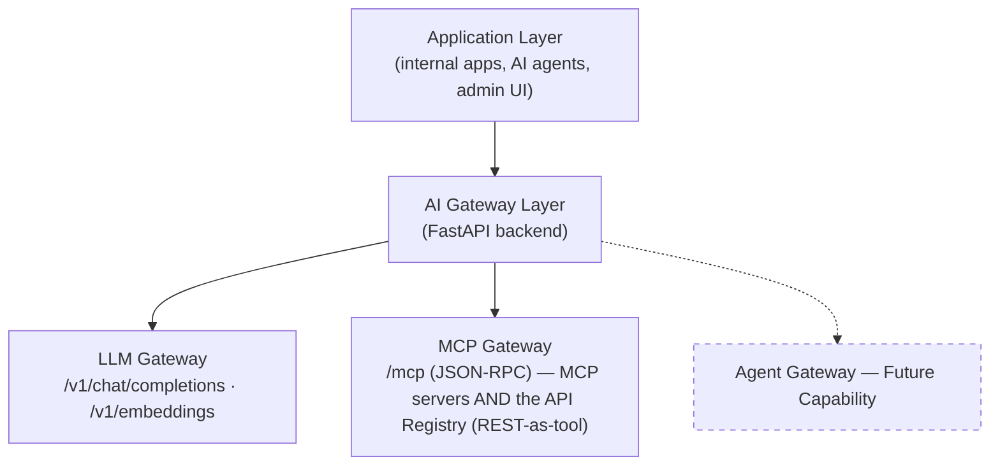
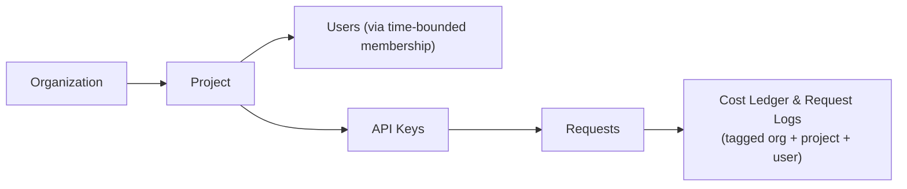

# Enterprise AI Gateway Platform — Technical Overview

This document describes the platform's actual implemented architecture, for Enterprise Architects, Solution Architects, Engineering Teams, and Security Teams evaluating or onboarding onto it. Every capability described below reflects the current codebase. Anything not yet built is explicitly labeled **Future Capability**, **Roadmap**, or **Planned Enhancement** — nothing below is aspirational unless marked as such.

---

## Reference Architecture



Both gateways are independent, governed subsystems inside one FastAPI process. There is no agent orchestration loop inside the platform today — an external AI agent that needs several tool calls to accomplish a task alternates between the two gateways itself, one HTTP call at a time (`POST /mcp` to discover/call tools, `POST /v1/chat/completions` to decide what to do next). Neither gateway is aware the other exists; this is a deliberate architectural boundary, not a missing feature, and is the exact seam the planned Agent Gateway will fill.

Every request, regardless of which gateway it targets, passes through the same middleware chain before reaching a handler:

```
request-id middleware → CORS → auth middleware
   (API key OR Identity Provider token, resolved via the Identity Provider Factory)
→ rate-limit middleware → router handler
→ BackgroundTask: request/cost/guardrail logging (after the response is sent)
```

---

## LLM Gateway Technical Capabilities

- **API gateway layer** — `POST /v1/chat/completions` and `POST /v1/embeddings`, both OpenAI-compatible in request/response shape, so existing OpenAI SDKs and tooling work against this gateway with only a base-URL change.
- **LiteLLM integration** — provider calls are made through an embedded `litellm.Router` (not a sidecar process), configured per-request from the resolved routing targets, with `num_retries` providing automatic retry-on-failure across a target list.
- **Provider abstraction** — `OpenAI`, `Anthropic`, and `AWS Bedrock` are wired in today behind a common internal interface. Adding a provider is a matter of registering its secret names and pricing entries, not rewriting request handling. (Google/Azure OpenAI secret names exist in the Secret Provider layer's naming convention today but are reserved for a future routing target — they are **not** currently callable through the gateway.)
- **Model routing** — `routing_rules` map a stable `model_alias` (what applications ask for) to one or more provider/model targets, scoped optionally to a project. Rules support `capability` separation (`chat` vs. `embedding` are never cross-resolved) and a selectable strategy: priority order, lowest cost, or lowest observed latency.
- **Failover** — when a routing rule lists multiple targets, LiteLLM's retry mechanism moves to the next target on failure, so a single provider outage does not necessarily fail the request.
- **Rate limiting** — a Valkey-backed sliding-window limiter (atomic increment + expiry via a Lua script) enforces per-API-key request limits on both `/v1/chat/completions` and `/v1/embeddings`.
- **Authentication** — every call requires a valid API key (hashed at rest, never stored or logged in plaintext) scoped to a project, with explicit scopes controlling what it may do.
- **Cost tracking** — every completed request is priced against an admin-maintained `model_pricing` table (per-1k-token USD rates) and written to a `cost_ledger`, attributed to project, organization, and user. Budgets can be defined at any of those three levels and are visible in real time against the ledger.
- **Response caching** — a Valkey-backed cache keyed on the normalized request payload avoids re-calling a provider for an identical prompt within the configured TTL, reducing both cost and latency.
- **Guardrails** — prompts are checked before a provider call and completions after, through a pluggable `GuardrailsClient` interface. The bundled implementation is a lightweight reference/mock service; production deployments plug in their own guardrails backend behind the same interface without any gateway code changes.
- **Observability** — see the dedicated section below; this is structured logging plus database-backed request/cost/guardrail tracking, not a distributed-tracing or metrics-export integration.

---

## MCP Gateway Technical Capabilities

- **MCP protocol support** — a single JSON-RPC entry point (`POST /mcp`) handles `initialize`, `tools/list`, and `tools/call`, using Streamable HTTP transport (buffered JSON over HTTP). Other MCP transports (STDIO, SSE) are not implemented today.
- **MCP server registration** — tool-providing servers are registered, updated, and removed through an admin-only registry API (`/mcp/servers`), each with its own base URL, transport type, and outbound auth configuration.
- **Tool discovery** — a discovery service calls each registered server's `initialize` and `tools/list` methods, reconciling the results into a gateway-wide tool catalog: new tools are added, stale ones removed, and name collisions resolved deterministically. Discovery runs on a periodic background refresh and can also be triggered on demand.
- **Health checking** — a dedicated health-check routine independently tracks each server's administrative status (active/inactive) and live health (healthy/unhealthy) on its own periodic loop; a tool is only routable when both are true, so an administratively-active-but-currently-down server cannot receive live traffic.
- **Tool invocation control** — `tools/call` requests are routed to the owning, currently-healthy server; per-tool rate limits apply independently of the coarser per-API-key limit.
- **Authentication** — the same identity resolution used everywhere else (API key or Identity Provider token) gates every MCP call.
- **Authorization** — reading the tool catalog and invoking a tool are distinct, separately grantable scopes (`tool:read` vs. `tool:execute`); role-based defaults apply automatically for Identity-Provider-authenticated users.
- **Policy enforcement** — the platform's RBAC/ABAC `PolicyEngine` (described below) evaluates every `tools/call` made by an Identity-Provider-authenticated human, checking their roles and identity provider against configured access policies before the call is forwarded. (API-key-authenticated machine callers are governed by their key's scopes instead, not by this policy layer — a deliberate separation between human and machine access paths.)
- **Session handling** — a persistent session mapping (survives a process restart) links a client-facing session ID to the per-server sessions established on its behalf, so multi-call tool interactions maintain server-side state correctly.
- **API Registry — REST APIs exposed as MCP tools** — an enterprise REST API is registered once (base URL, auth type, timeout, retry policy), and each of its endpoints is registered individually (HTTP method, path, parameters); registering an endpoint immediately generates its callable MCP tool with an auto-derived schema — no MCP server, and no separate discovery step, since a REST endpoint isn't introspectable the way `tools/list` is. Path/query/header/body arguments are built automatically from the registered parameters; credentials (API key, bearer, basic, or OAuth2 client-credentials) are resolved through the same Secret Provider abstraction used for LLM providers, never a raw environment variable. A non-2xx response from the target API comes back as an ordinary tool result (`isError: true`), not a gateway failure — the same distinction a real MCP server's own tool failures already get. Every governance mechanism above (auth, scopes, per-tool and per-API-service rate limits, RBAC/ABAC policy) applies identically whether a tool is MCP- or REST-backed; an agent has no way to tell, and does not need to.

---

## Security Architecture

### Authentication

The platform never couples directly to a single identity provider. An `IdentityProvider` abstraction defines four operations — validate a token, resolve user info, resolve roles, resolve groups — that every concrete provider implements identically from the caller's perspective. **Six providers are implemented today**: Keycloak (the default), Microsoft Entra ID, Auth0, Okta Workforce Identity Cloud, AWS IAM Identity Center, and Google Identity Platform/Workspace. All six share one JWT validation routine: RS256-only signatures, JWKS keys fetched and cached per issuer, with expiration, issuer, and audience validation enforced whenever configured.

Multi-tenant deployments can run **different identity providers for different tenants against the same gateway process**: a `tenant_identity_config` table maps a token's issuer to a tenant-specific provider configuration, resolved automatically per request before the actual signature-verified validation occurs.

Every resolved identity is normalized into a single `UserIdentity` shape (user ID, email, tenant, provider, roles, groups, attributes) — nothing downstream of authentication (the RBAC layer, MCP Gateway, admin APIs) contains any provider-specific logic. Adding a seventh identity provider requires only a new provider class and a factory registration — no changes to routing, policy evaluation, or any API route.

### Secret Management

Provider credentials and other sensitive configuration values are never read from plain environment variables scattered through the codebase. A parallel `SecretProvider` abstraction, built on the same factory pattern, resolves every secret by name from exactly one configured backend. **Five backends are implemented today**: this app's own Postgres database (the default, Fernet-encrypted at rest), Infisical (the default), AWS Secrets Manager, Google Secret Manager, Azure Key Vault, and HashiCorp Vault. Resolved values are cached briefly (Valkey-backed, short TTL) to avoid a secret-store round trip on every request, with an explicit force-refresh path for rotation. No secret value is ever persisted to the application database or written to a log line — only metadata (which secret, by whom, when, success/failure) is recorded in an audit table.

The API Registry's REST tool credentials (API key, bearer token, basic auth, OAuth2 client-credentials) are resolved through this exact same abstraction — a deliberate improvement over the MCP Server Registry's own outbound auth, which still reads a named environment variable directly rather than going through the Secret Provider layer.

### Security controls

- **API keys** — hashed at rest (HMAC, keyed by a server-side pepper), scoped to a single project, carrying explicit capability scopes, individually revocable.
- **RBAC** — a fixed role set (admin, team lead, developer, viewer) gates every admin-facing API route.
- **Policy enforcement (RBAC/ABAC)** — a separate, identity-agnostic `PolicyEngine` evaluates configurable access policies (allowed roles, allowed identity providers, allowed tool names, and a token-count ceiling field) against a resolved `UserIdentity` and the tool being invoked. Today this is wired into the MCP Gateway's `tools/call` path for human callers only, applying identically whether the tool is MCP- or REST-backed. Evaluation stops at the tool name — it does not inspect the call's actual arguments (e.g. transaction amount); that's a **Roadmap** item, not a current capability.
- **Audit logging** — secret access operations (read/rotate) are recorded to a dedicated audit table with actor, operation, and outcome. Request-level activity (every chat/embedding/tool call) is separately captured in the observability tables described below. **A general-purpose admin-action audit trail beyond secrets is not yet implemented — Planned Enhancement.**

**Not yet implemented** (explicit scope boundaries, not oversights):
- Encrypted-at-rest storage of provider/tool credentials — only a reference (secret name) is stored in the application database; the actual value always lives in the configured Secret Provider backend.
- Enforcement of the `AccessPolicy` token-count ceiling at request time — the field is stored and returned by the admin API but not yet checked against a live request. **Roadmap.**
- Hard budget enforcement — budgets are computed and visible in real time but do not yet block a request that would exceed them. **Roadmap.**

---

## Observability

The platform's current observability is **structured logging plus database-backed usage analytics** — precision matters here, so this section states plainly what exists and what does not:

**Implemented today:**
- **Structured logs** — every request is logged as structured JSON (via `structlog`) with a request ID that is generated (or propagated) at the very start of the middleware chain and threaded through every log line for that request, making a single request's activity traceable across log output.
- **Request-level tracking** — every LLM Gateway and MCP Gateway call writes a row to a dedicated request-log table (model/tool resolved, status, latency, token counts) as a background task after the response is already sent to the client, so logging never adds latency.
- **Cost analytics** — every priced request writes to a cost ledger attributed to organization/project/user, queryable through an aggregated usage-summary API (cost, request counts, cache-hit rate, per-model breakdown) and a paginated, filterable request-log query API. Both back the admin UI's usage dashboards.
- **Guardrail outcomes** — prompt and response guardrail checks are recorded per request, linked to the request log.

**Not implemented today — Roadmap / Future Capability:**
- **Distributed tracing** — no OpenTelemetry (or equivalent) SDK is integrated; there is no span/trace propagation across service boundaries.
- **Metrics export** — no Prometheus (or equivalent) metrics endpoint exists; the platform does not currently expose a `/metrics` scrape target.
- **APM/dashboard integration** — no built-in exporter to Grafana, Datadog, or similar; today's dashboards are the platform's own admin UI, driven by its own database tables.

Organizations requiring OpenTelemetry-based tracing or Prometheus metrics today should treat this as a near-term integration point rather than an existing capability.

---

## Multi-Tenant Architecture



- **Tenant isolation** — the tenancy hierarchy is Organization → Project → Users/API Keys. Every API key belongs to exactly one project; every request log and cost ledger entry carries organization, project, and (where applicable) user identifiers.
- **Application onboarding** — a new application is onboarded by creating (or reusing) an organization and project, then issuing it a scoped API key — no code change to the gateway itself.
- **API key management** — keys are issued, listed, and revoked through an admin API and UI; revocation is immediately effective (the key's cached auth state is invalidated).
- **Usage attribution** — cost and request data is always attributable down to organization, project, and (for identity-provider-authenticated calls) the specific user, powering both the admin dashboards and any downstream chargeback process.

**Scope note:** `provider_configs` (which LLM providers are enabled and their credential references) is currently a global, not per-tenant, configuration. The Secret Provider layer supports a per-tenant secret lookup parameter, but it is not yet wired into live chat/embeddings routing — true per-tenant "bring your own provider key" routing is a **Planned Enhancement**, not a current capability.

---

## Deployment Architecture

**Supported today:**
- **Docker** — every component (backend, frontend, Postgres, Valkey, Keycloak, and a reference guardrails service) ships with its own Dockerfile and a single `docker-compose.yml` that brings up the full stack for local development or a single-node deployment.
- **Cloud environments** — because every provider-facing dependency (identity, secrets, LLM providers) is abstracted behind a pluggable factory, the platform itself is cloud-agnostic; it runs anywhere a container runtime and a Postgres/Redis-compatible pair are available, whether that's a VM, an existing container platform, or a managed Kubernetes cluster running the same images.

**Not yet implemented — Roadmap:**
- **Kubernetes manifests / Helm charts** — no Kubernetes-native deployment artifacts exist yet. The application's container images are Kubernetes-compatible, but manifests, Helm values, and a CI/CD pipeline for cluster deployment are a planned enhancement, not a current deliverable.

---

## Integration Architecture

### LLM providers

| Provider | Status |
|---|---|
| OpenAI | Implemented |
| Anthropic | Implemented |
| AWS Bedrock | Implemented |
| Self-hosted / other models (e.g. Google Gemini, Azure OpenAI) | Reserved naming exists in the Secret Provider layer; routing integration is **Planned Enhancement**, not yet callable |

### Identity providers

| Provider | Status |
|---|---|
| Keycloak | Implemented (default) |
| Microsoft Entra ID | Implemented |
| Auth0 | Implemented |
| Okta Workforce Identity Cloud | Implemented |
| AWS IAM Identity Center | Implemented |
| Google Identity Platform / Workspace | Implemented |

### Secret management backends

| Backend | Status |
|---|---|
| Postgres | Implemented (default) |
| Infisical | Implemented (default) |
| AWS Secrets Manager | Implemented |
| Azure Key Vault | Implemented |
| Google Secret Manager | Implemented |
| HashiCorp Vault | Implemented |

All three integration surfaces above follow the identical pattern: an abstract interface, a factory that selects an implementation by configuration, and zero provider-specific logic anywhere outside that provider's own file. This is the same pattern the Agent Gateway will extend.

### Tool execution backends

Unlike the fixed enumerations above, this integration surface is open-ended by design — any compliant backend can be registered without a code change:

| Backend | Status |
|---|---|
| MCP servers (any MCP-protocol-compliant server, Streamable HTTP transport) | Implemented |
| Enterprise REST APIs (any REST API, via the API Registry — see the MCP Gateway section above) | Implemented |

Both are exposed to callers as the same primitive — an MCP tool — through the same `POST /mcp` entry point, governed by the same auth/rate-limit/policy/observability stack.

---

## Agent Gateway Roadmap

**Status: Future Capability — no implementation exists in the current codebase.** Nothing in this section describes a built feature; it describes the intended extension of the existing architectural pattern to a third governed surface.

Today, an external AI agent framework already *consumes* both existing gateways — calling `POST /mcp` to discover and invoke tools, and `POST /v1/chat/completions` to reason about what to do next — entirely outside this codebase, one HTTP call at a time. The Agent Gateway's planned role is to bring that consumption pattern under the same governance the platform already applies to models and tools:

- **Agent registry** — a formal catalog of agents, analogous to today's MCP server registry, recording what an agent is, where it runs, and its administrative status.
- **Agent identity** — extending the existing `IdentityProvider`/`UserIdentity` abstraction so an agent — not just a human or an API key — can be a first-class, authenticatable principal.
- **Agent discovery** — an API applications and other agents can query to find available agents and their declared capabilities, mirroring the MCP Gateway's tool-discovery model.
- **Agent authorization** — extending the existing `PolicyEngine`/`AccessPolicy` model so policies can gate which agents a caller may invoke, not only which tools.
- **Agent-to-agent communication governance** — a controlled, logged path for one agent to invoke another, rather than agents calling each other directly and invisibly to the platform.
- **Agent lifecycle management** — provisioning, versioning, deprecating, and retiring agents under the same administrative control the platform already applies to MCP servers and identity/secret provider configuration.

Because identity, secrets, LLM providers, MCP tool servers, and now REST APIs (via the API Registry) are all already built as pluggable abstractions or registrable backends behind stable interfaces, the Agent Gateway's design goal is to be additive: a new subsystem alongside the LLM and MCP Gateways, consuming the same `UserIdentity` and `PolicyEngine` primitives, without requiring changes to either existing gateway's request path. The API Registry is the most recent proof of that pattern holding: it added a second tool-execution backend to the MCP Gateway without altering `POST /mcp`'s contract or any existing MCP-server call site.
